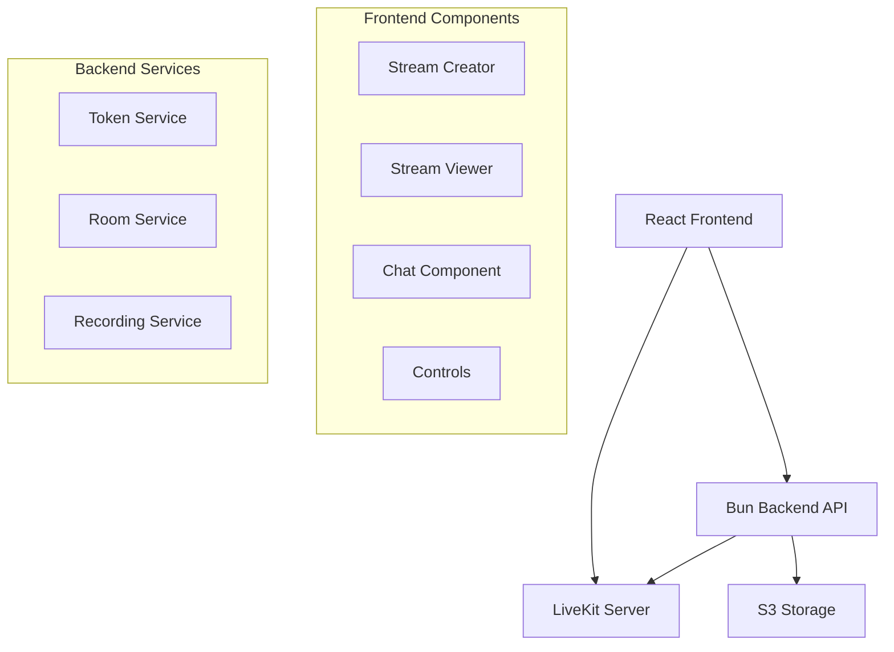

# Design Document

## Overview

This design outlines a minimal video streaming platform using LiveKit WebRTC infrastructure. The system consists of a React frontend (already set up with Vite) and a Bun-powered Node.js backend. The platform enables streamers to create streams, viewers to join via links, real-time chat functionality, and optional S3 recording storage.

## Architecture



## Components and Interfaces

### Frontend Components

#### 1. App Router
- **Purpose**: Route between stream creation and viewing
- **Routes**:
  - `/` - Home page with "Create Stream" button
  - `/stream/:roomId` - Stream viewer/participant page
  - `/host/:roomId` - Stream host page

#### 2. StreamCreator Component
- **Purpose**: Allow users to create new streams
- **Features**:
  - Generate unique room ID
  - Get LiveKit token from backend
  - Start LiveKit room as host
  - Display shareable stream link
  - Show basic controls (mute, camera, end stream)

#### 3. StreamViewer Component
- **Purpose**: Allow users to join existing streams
- **Features**:
  - Connect to LiveKit room as viewer
  - Display streamer's video/audio
  - Show chat interface
  - Viewer-only mode (no camera/mic by default)

#### 4. ChatComponent
- **Purpose**: Real-time messaging during streams
- **Features**:
  - Send/receive messages via LiveKit data channels
  - Display participant names with messages
  - Auto-scroll to latest messages
  - Simple text input interface

#### 5. StreamControls Component
- **Purpose**: Basic stream management for hosts
- **Features**:
  - Mute/unmute microphone
  - Enable/disable camera
  - Start/stop recording button
  - End stream button
  - Recording status indicator

#### 6. RecordingButton Component
- **Purpose**: Control live stream recording
- **Features**:
  - Toggle recording on/off during stream
  - Visual recording indicator (red dot when active)
  - Display recording status and duration
  - Show S3 URL after recording completion

### Backend Services

#### 1. Token Service
- **Endpoint**: `POST /api/token`
- **Purpose**: Generate LiveKit access tokens
- **Input**: `{ roomName, participantName, isHost }`
- **Output**: `{ token, serverUrl }`
- **Logic**: 
  - Hosts get publish/subscribe permissions
  - Viewers get subscribe-only permissions

#### 2. Room Service
- **Endpoint**: `POST /api/rooms`
- **Purpose**: Create new stream rooms
- **Input**: `{ hostName }`
- **Output**: `{ roomId, hostToken, shareUrl }`
- **Logic**: Generate unique room ID and host token

#### 3. Recording Service
- **Endpoints**: 
  - `POST /api/recordings/start` - Start LiveKit egress recording
  - `POST /api/recordings/stop` - Stop LiveKit egress recording
- **Purpose**: Manage live stream recordings using LiveKit egress to S3
- **Input**: `{ roomName }` for start, `{ egressId }` for stop
- **Output**: `{ egressId, status }` for start, `{ s3Url, status }` for stop
- **Logic**: Use LiveKit EgressClient for real-time recording to S3

## Data Models

### Room Model
```typescript
interface Room {
  id: string;
  hostName: string;
  createdAt: Date;
  isActive: boolean;
  recordingUrl?: string;
  egressId?: string;
  isRecording: boolean;
}
```

### Chat Message Model
```typescript
interface ChatMessage {
  id: string;
  participantName: string;
  message: string;
  timestamp: Date;
}
```

### Token Request Model
```typescript
interface TokenRequest {
  roomName: string;
  participantName: string;
  isHost: boolean;
}
```

### Recording Models
```typescript
interface RecordingRequest {
  roomName: string;
}

interface RecordingResponse {
  egressId: string;
  roomName: string;
  filePath: string;
  status: 'starting' | 'active' | 'stopping' | 'completed' | 'failed';
}

interface RecordingStopRequest {
  egressId: string;
}

interface RecordingStopResponse {
  egressId: string;
  s3Url?: string;
  status: 'completed' | 'failed';
  error?: string;
}
```

## Error Handling

### Frontend Error Handling
- **Connection Errors**: Display retry button and error message
- **Room Not Found**: Show "Stream not found" message with home link
- **Permission Errors**: Display appropriate access denied messages
- **Network Issues**: Show connection status indicators

### Backend Error Handling
- **Invalid Room ID**: Return 404 with clear error message
- **Token Generation Failure**: Return 500 with retry instructions
- **S3 Upload Failure**: Return error status with fallback options
- **LiveKit Connection Issues**: Log errors and return service unavailable

## Testing Strategy

### Frontend Testing
- **Component Tests**: Test each component renders correctly
- **Integration Tests**: Test LiveKit room connection flow
- **Chat Tests**: Verify message sending/receiving
- **Error Handling Tests**: Test error states and recovery

### Backend Testing
- **API Tests**: Test all endpoints with valid/invalid inputs
- **Token Generation Tests**: Verify correct permissions are set
- **S3 Integration Tests**: Test file upload functionality
- **Error Response Tests**: Verify proper error codes and messages

## Implementation Details

### LiveKit Configuration
- **Server**: Use LiveKit Cloud for simplicity
- **Tokens**: Generate with appropriate permissions based on role
- **Data Channels**: Use for real-time chat messaging
- **Egress Recording**: Real-time recording to S3 using LiveKit EgressClient
- **Recording Format**: MP4 files with grid layout for multiple participants

### LiveKit Egress Recording Architecture

#### Recording Service Implementation
```typescript
class LiveStreamRecorder {
  private egressClient: EgressClient;
  
  constructor() {
    this.egressClient = new EgressClient(
      process.env.LIVEKIT_URL!,
      process.env.LIVEKIT_API_KEY!,
      process.env.LIVEKIT_API_SECRET!
    );
  }

  async startLiveRecording(roomName: string) {
    const fileOutput: EncodedFileOutput = {
      fileType: 'MP4',
      filepath: `live-recordings/${roomName}/${Date.now()}.mp4`,
      s3: {
        accessKey: process.env.AWS_ACCESS_KEY_ID!,
        secret: process.env.AWS_SECRET_ACCESS_KEY!,
        region: process.env.AWS_REGION!,
        bucket: process.env.S3_BUCKET_NAME!,
      } as S3Upload,
    };

    return await this.egressClient.startRoomCompositeEgress(
      roomName,
      fileOutput,
      { layout: 'grid', audioOnly: false, videoOnly: false }
    );
  }

  async stopLiveRecording(egressId: string) {
    return await this.egressClient.stopEgress(egressId);
  }
}
```

#### Recording API Endpoints
- **POST /api/recordings/start**: Start recording for a room
- **POST /api/recordings/stop**: Stop recording and get S3 URL
- **GET /api/recordings/:roomId**: Get recording status for a room

#### Frontend Recording Integration
- **useLiveRecording Hook**: Manage recording state and API calls
- **RecordButton Component**: UI control for starting/stopping recordings
- **Recording Status**: Visual indicators for active recording state

### Frontend State Management
- **React State**: Use useState for simple component state
- **LiveKit Hooks**: Leverage @livekit/react-core hooks
- **No Complex State**: Keep it simple, avoid Redux/Zustand

### Backend Architecture
- **Bun Runtime**: Use Bun for fast startup and TypeScript support
- **Express-like API**: Simple REST endpoints
- **Environment Variables**: Store LiveKit credentials and S3 config
- **Minimal Database**: In-memory storage for active rooms (optional)

### Security Considerations
- **Token Expiration**: Set reasonable token expiry times
- **Room Access**: Validate room existence before token generation
- **S3 Permissions**: Use pre-signed URLs for secure uploads
- **Input Validation**: Sanitize all user inputs

### Performance Optimizations
- **Lazy Loading**: Load components only when needed
- **Connection Quality**: Let LiveKit handle adaptive streaming
- **Chat Throttling**: Limit message frequency to prevent spam
- **Memory Management**: Clean up connections on component unmount

## Deployment Configuration

### Environment Variables
```bash
# LiveKit Configuration
LIVEKIT_API_KEY=your_api_key
LIVEKIT_API_SECRET=your_secret
LIVEKIT_URL=wss://your-project.livekit.cloud

# S3 Configuration (Required for Recording)
AWS_ACCESS_KEY_ID=your_access_key
AWS_SECRET_ACCESS_KEY=your_secret
AWS_REGION=us-east-1
S3_BUCKET_NAME=your-recordings-bucket

# Server Configuration
PORT=3001
NODE_ENV=production
```

### Build Process
- **Frontend**: Vite build with TypeScript compilation
- **Backend**: Bun build for optimized production bundle
- **Docker**: Optional containerization for deployment
- **Static Assets**: Serve frontend build from backend in production